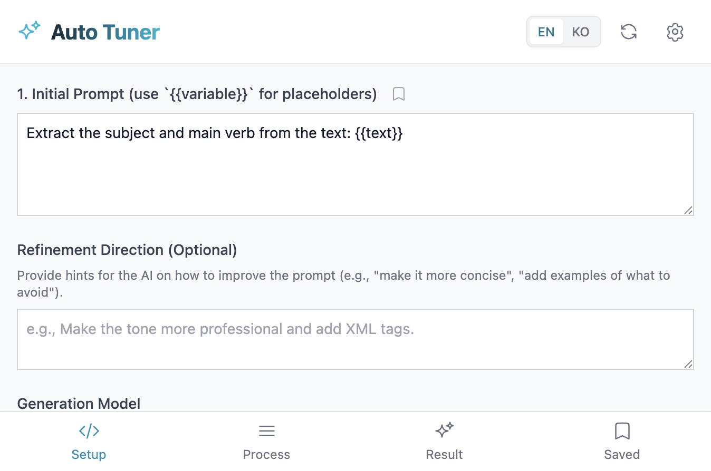

# autotuner


*Prompt engineering is fundamentally repetitive experimentation. You look at the output, tweak the prompt, run it again — by hand, every time. autotuner hands that loop off to an LLM. Register a few test cases and it analyzes, revises, and repeats until everything passes.*

*We do this manually every time we build an LLM application. These days, we sometimes delegate even that to AI agents like Claude Code — but most prompts remain untuned and waste tokens. A well-tuned prompt can turn a task that seemed to require Gemini Pro into one that works fine with Gemini Flash Lite — 20x cheaper on input, 30x cheaper on output. autotuner does that automatically. I built this for personal use in September 2025 and still reach for it regularly. - @kargnas*

The idea: treat a prompt like code with tests. Register positive test cases ("given this input, I want this output") and negative ones ("given this input, this output must not appear"), then let the LLM run the eval-refine loop until everything passes. Evaluation is semantic, not string-matching — the model judges whether the intent was met and explains why it passed or failed. That reasoning becomes the input to the next refinement step.

## How it works

Three files do most of the work.

- **`services/llmService.ts`** — the core agent loop. Four functions: `runPrompt`, `evaluateOutput`, `diversifyTestCases`, `refinePrompt`. The LLM runs the prompt, another LLM evaluates the result, and on failure a third call generates a revised prompt with a reasoning trace attached.
- **`server/index.ts`** — a thin Express server that holds the OpenRouter API key server-side. The frontend only calls `/api/chat` and never touches the key directly. This keeps the key out of the JS bundle.
- **`App.tsx`** — session state and UI. Handles test case registration, tuning runs, result inspection, and prompt saving.

## Quick start

Requires an [OpenRouter](https://openrouter.ai) API key.

**Option 1 — npx (no install)**

```bash
export OPENROUTER_API_KEY=sk-or-...
npx prompt-autotuner
```

Opens at `http://localhost:3000`.

**Option 2 — dev mode (with hot reload)**

```bash
git clone https://github.com/kargnas/prompt-autotuner
cd prompt-autotuner
pnpm install
export OPENROUTER_API_KEY=sk-or-...
pnpm dev
```

## Project structure

```
server/
  index.ts          — API proxy. OpenRouter key lives here only
services/
  llmService.ts     — runPrompt / evaluateOutput / diversifyTestCases / refinePrompt
  contentService.ts
components/         — React components
docs/               — prompting guides (XML structure, design strategies)
App.tsx
types.ts
vite.config.ts      — proxies /api/* to localhost:3001
```

## Design choices

- **Separate generation and evaluation models.** A fast model generates the output; a more capable model evaluates it. This gives better cost-to-quality than using the same model for both. Both are configurable independently. Gemini 2.5 Flash Lite runs at ~173 tok/s vs Gemini 3.1 Pro's ~51 tok/s — 3.4x faster throughput on top of the cost savings.
- **LLM-based evaluation.** String matching produces too many false negatives on natural language output. The evaluator understands semantic equivalence and produces a reasoning trace. That trace is what actually drives the refinement — without it, the editor is flying blind.
- **Negative test cases.** Not just "this output should appear" but "this output must not appear." Useful when you need the prompt to avoid specific patterns or framings.
- **Test case diversification.** Given one example, the model generates variations automatically. Saves the tedium of writing edge cases by hand.
- **OpenRouter routing.** One API key covers GPT, Claude, Gemini, and others. Useful for comparing how different models respond to the same prompt under tuning pressure.
- **Key stays server-side.** Vite proxies `/api/*` to the Express server on port 3001. Nothing sensitive ends up in the frontend bundle.

---

*한국어 설명*

LLM 앱을 만들다 보면 프롬프트를 손으로 고치고, 실행해보고, 또 고치는 작업을 계속 반복하게 됩니다. 요즘은 이 작업을 Claude Code 같은 AI 에이전트에 넘기기도 하는데, 그래도 대부분의 프롬프트는 제대로 튜닝되지 않은 채 토큰을 낭비하고 있습니다. 튜닝을 한 번만 제대로 거치면, Gemini Pro가 필요해 보이던 작업을 Gemini Flash Lite로 처리할 수 있게 됩니다. 입력 기준으로 20배 저렴하고, 출력 기준으로는 30배 차이입니다. autotuner는 그 과정을 자동으로 해주는 도구입니다. 2025년 9월에 혼자 쓰려고 만들었는데, 지금도 자주 꺼내 씁니다.

아이디어 자체는 단순합니다. 프롬프트를 테스트가 있는 코드처럼 취급하는 겁니다. "이 입력에는 이 출력이 나와야 한다"는 긍정 케이스와 "이 출력이 나오면 안 된다"는 부정 케이스를 정의해두면, LLM이 평가-수정 루프를 전부 통과할 때까지 돌립니다. 평가는 문자열 비교가 아니라 의미 판단으로 하기 때문에, 표현이 조금 다르더라도 의도가 맞으면 통과합니다. 실패 이유도 자연어로 설명해주고, 그게 다음 수정 단계의 입력이 됩니다.

---

| | |
|:---:|:---:|
|  |  |

## License

MIT
